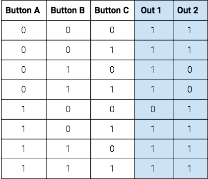

Feedback Nov 28 (you can delete this section later it will remain in the history)

|No.|How to improve        |
|-|------------- |
|①| The definition of the problem needs some work. You described the context very creatively, now invent a ficticious client. Answer the questions: Who is the client? Why is the product being developed? Then you can add at least 5 success criteria that are measurable. 
|②|Add the proposed solution justifying the choices of software (C) and tools (Arduino). here you can include your homework on comparing BASH and Arduino's C. Also add measurable success criteria.
|③| Under the development section, you are including all the source code for the programs. It is better if you include only small parts of the code that are new to you or that show an important algorithm. This is because the source code is anyway in the repo so no need to repeat. 

**For example:** The code below shows how to read the status of a button connected to port 13 in the Arduino:
```.c
bool A = digitalRead(13);
```
Note that the variable A was created of type Bool since the input is binary data.|

|No.|How to improve        |
|-|------------- |
|④| Your evidence of progress is limited to one picture without caption or description. Add figure caption to your figures and then explain what you see in them. Figures are quite ambiguous by themselves.| 

**For example:**


**Fig. 2.** Circuit used to create a traffic light system with 3 LEDs.

As shown in **Fig. 2**, the circuit used for... which includes... this demonstrates that

|No.|How to improve        |
|-|------------- |
|⑤| Keep working on the development section, adding references when you used online sources. I have added the Reference section at the end of this document. Use the references in the text. See example below.| 


----

MARTIAN DECODER
===========================
A Communication method between Earth, Moon, and Mars in Arduino

Contents
-----
  1. [Planning](#planning)
  2. [Design](#design)
  3. [Development](#development)
  4. [Evalution](#evaluation)
  
  Planning 
  ----------
 
### Definition of the Problem

The year is 2050 and many people want to explore different planets, but one problem that they are facing is they can't communicate with other planets. This is happening due to lack of developing advance communicating tools. We are assigned to make a communicating tool that connect Earth, Moon, and Mars. Since its hard to transfer all the data from Earth to Mars, we made moon be the mediator of Earth and Mars. The people in Mars wanted all their communicaton system as Binary Code and for people in the moon to transfer the informaion from Earth to Binary Code they require the communication system from eath be Morse Code. The reverse has to happen to, Mars people will send binary Code to moon and moon peoeple will convert binary code to Morse code. 

### Proposed Solution
(coming soon)

Design
---------
(coming soon)


Development
--------

This code will print the table below in using LED



``` Arduino
int butA = 13;
int butB = 12;
int butC = 11;
int out1 = 3;
int out2 = 4;

void setup()
{
  pinMode(butA, INPUT);
  pinMode(butB, INPUT);
  pinMode(butC, INPUT);
  pinMode(out1, OUTPUT);
  pinMode(out2, OUTPUT);
}

void loop(){

  if(digitalRead(butA)== LOW && (butB) == LOW && (butB) == LOW){
    digitalWrite(out1, HIGH);
    digitalWrite(out2, HIGH);
  }
  
  if(digitalRead(butA)== LOW && (butB) == LOW && (butB) == HIGH){
    digitalWrite(out1, HIGH);
    digitalWrite(out2, HIGH);
  }
  if(digitalRead(butA)== LOW && (butB) == HIGH && (butB) == LOW){
    digitalWrite(out1, HIGH);
    digitalWrite(out2, LOW);
  }
  if(digitalRead(butA) == LOW && (butB) == HIGH && (butB) == HIGH){
    digitalWrite(out1, HIGH);
    digitalWrite(out2, LOW);
  }
  if(digitalRead(butA) == HIGH && (butB) == LOW && (butB) == LOW){
    digitalWrite(out1, LOW);
    digitalWrite(out2, HIGH);
  }
  if(digitalRead(butA) == HIGH && (butB) == LOW && (butB) == HIGH){
    digitalWrite(out1, HIGH);
    digitalWrite(out2, HIGH);
  }
  if(digitalRead(butA) == HIGH && (butB) == HIGH && (butB) == LOW){
    digitalWrite(out1, HIGH);
    digitalWrite(out2, HIGH);
  }
  if(digitalRead(butA) == HIGH && (butB) == HIGH && (butB) == HIGH){
    digitalWrite(out1, HIGH);
    digitalWrite(out2, HIGH);
  }
}
```
This code will convert decimal to binary but through LED


``` Arduino 

int ALED = 13;

int BLED = 12;

int CLED = 11;

int DLED = 10;

int ELED = 9;


void setup()
{
  pinMode(13, OUTPUT);
  pinMode(12, OUTPUT);
  pinMode(11, OUTPUT);
  pinMode(10, OUTPUT);
  pinMode(9, OUTPUT);
  
}

void loop()
{
  for (int j = 0; j <= 31; j++){
    delay(1000);
    digitalWrite(ALED, LOW);
    digitalWrite(BLED, LOW);
    digitalWrite(CLED, LOW);
    digitalWrite(DLED, LOW);
    digitalWrite(ELED, LOW);
    
    if (j % 2 != 0){
      digitalWrite(ELED, HIGH);
    }
    if (j % 4 > 1) {
      digitalWrite(DLED, HIGH);
    }
    
    if (j % 8 > 3) {
      digitalWrite(CLED, HIGH);
    }
    if (j % 16 > 7) {
      digitalWrite(BLED, HIGH);
    }
    if (j % 32 > 15) {
      digitalWrite(ALED, HIGH);
    }
      }
}


```

### Usibility
According to Techopedia [1] "Usability is the degree of ease with which products such as software and Web applications can be used to achieve required goals effectively and efficiently."
### Discoveribility Feedback
(need to understand more)


Evaluation
-----------
(coming soon )


## Reference
-----------

[1] “What Is Usability? - Definition from Techopedia.” Techopedia.com, https://www.techopedia.com/definition/4919/usability.


